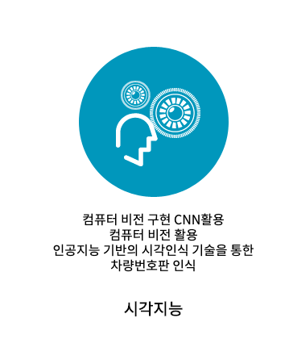

# [AI 이노베이션 스퀘어] 고급 시각 저녁반 12 기

---

  <h2 style='font-weight: bold; font-size:18px;'>주관</h2>
  
  &nbsp;&nbsp;&nbsp;
  

 

## 필기자료(링크)
 
### [1일차 필기자료 : 영상 처리/딥러닝을 위한 Python Programming1]()
### [2일차 필기자료 : 영상 처리/딥러닝을 위한 Python Programming2]()
### [3일차 필기자료 : 영상 처리/딥러닝을 위한 Python Programming3]()
### [4일차 필기자료 : 영상 처리/딥러닝을 위한 Python Programming4]()
### [5일차 필기자료 : 영상 처리/딥러닝을 위한 Python Programming5]()
### [6일차 필기자료 : Numpy,Scipy,Scikit-image를 통한 기본 영상 처리1]()
### [7일차 필기자료 : Numpy,Scipy,Scikit-image를 통한 기본 영상 처리2]()
### [8일차 필기자료 : Numpy,Scipy,Scikit-image를 통한 기본 영상 처리3]()
### [9일차 필기자료 : Numpy,Scipy,Scikit-image를 통한 기본 영상 처리4]()
### [10일차 필기자료 : Numpy,Scipy,Scikit-image를 통한 기본 영상 처리5]()
### [11일차 필기자료 : OPENCV를 활용한 영상 처리1]()
### [12일차 필기자료 : OPENCV를 활용한 영상 처리2]()
### [13일차 필기자료 : OPENCV를 활용한 영상 처리3]()
### [14일차 필기자료 : OPENCV를 활용한 영상 처리4]()
### [15일차 필기자료 : OPENCV를 활용한 영상 처리5]()
