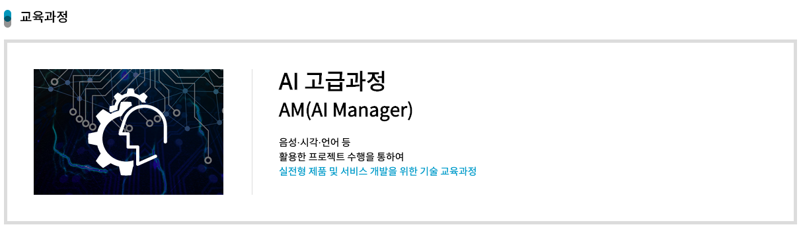
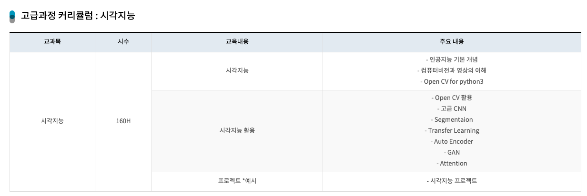

# [AI 이노베이션 스퀘어] 고급 시각 저녁반 12 기

---

  <h2 style='font-weight: bold; font-size:18px;'>주관</h2>
  
  &nbsp;&nbsp;&nbsp;
  

 

## 필기자료(링크)
 
### [1일차 필기자료 : 영상 처리/딥러닝을 위한 Python Programming1](https://github.com/hysKim1/AI_Vision/blob/master/200901_12기_고급시각반.ipynb)
    - Functional paradigm: Function , iterable :반복문, comprehension , iterator, generator,Higher order function:map, filter,reduce 
### [2일차 필기자료 : 영상 처리/딥러닝을 위한 Python Programming2](https://github.com/hysKim1/AI_Vision/blob/master/200902_12기_고급시각반.ipynb)
    - itertools : accumulate, chain, combinations, combinations_with_replacement, count, cycle, islice, groupby, filterfalse, takewhile,starmap
    - functools : singledispatch, patrial
    - operator: add,sub,mul
### [3일차 필기자료 : 영상 처리/딥러닝을 위한 Python Programming3](https://github.com/hysKim1/AI_Vision/blob/master/200903_12기_고급시각반.ipynb)
    - encapsulation : class, class attribute, instance, method, instance attribute, class method, static method
### [4일차 필기자료 : 영상 처리/딥러닝을 위한 Python Programming4](https://github.com/hysKim1/AI_Vision/blob/master/200904_12기_고급시각반.ipynb)
    - overloading, 연산자 오버로딩, 상속 : __mro__, super, composition, 다형성
### [5일차 필기자료 : 영상 처리/딥러닝을 위한 Python Programming5](https://github.com/hysKim1/AI_Vision/blob/master/200907_12기_고급시각반.ipynb)
    - descriptor:get,set,del   
    - property, Metaclass :singleton

### [6일차 필기자료 : Numpy,Scipy,Scikit-image를 통한 기본 영상 처리1](https://github.com/hysKim1/AI_Vision/blob/master/200908_12기_고급시각반.ipynb)
     - Numpy,  Numpy 데이터 구조, 데이터 저장 방식, Image : 형태: bitmap, vector  ,차원 , 구성:NHWC, channel: 색상(RGB), 흑백(intensity)
### [7일차 필기자료 : Numpy,Scipy,Scikit-image를 통한 기본 영상 처리2](https://github.com/hysKim1/AI_Vision/blob/master/200909_12기_고급시각반.ipynb)
    - 영상처리 library, Numpy 기반 라이브러리 통해서 전처리, 데이터셋 구축 : 1. Numpy 기반 이미지 불러오기 : matplotlib, imageio, skimage, 2.데이터 크기 맞추기: slicing,resize, crop 3. 데이터 합치기: stack
### [8일차 필기자료 : Numpy,Scipy,Scikit-image를 통한 기본 영상 처리3](https://github.com/hysKim1/AI_Vision/blob/master/200910_12기_고급시각반.ipynb)
    - Pickle Scikit 모델 저장
    - 자르기 : crop, slicing, resize
    - rescale 
    - interpolation 보간
    - 이미지 뒤집기 : comma,flip(axis= ) flipud, fliplr
### [9일차 필기자료 : Numpy,Scipy,Scikit-image를 통한 기본 영상 처리4](https://github.com/hysKim1/AI_Vision/blob/master/200911_12기_고급시각반.ipynb)
    - Channel, ImageDraw: 도형 그리기 (mutable technique)
### [10일차 필기자료 : Numpy,Scipy,Scikit-image를 통한 기본 영상 처리5](https://github.com/hysKim1/AI_Vision/blob/master/200914_12기_고급시각반.ipynb)
    -  ImageDraw :text로 한글 입력
    - 좌표축 :meshgird, ix_, mgird,ogrid
    - mask 이용하여 그리기 :선,원
    - 회전행렬 히용하여 원 그리기
### [11일차 필기자료 : OPENCV를 활용한 영상 처리1](https://github.com/hysKim1/AI_Vision/blob/master/200915_12기_고급시각반.ipynb)
    -  Einsum, OpenCV
### [12일차 필기자료 : OPENCV를 활용한 영상 처리2](https://github.com/hysKim1/AI_Vision/blob/master/200916_12기_고급시각반.ipynb)
    -  OpenCV 이용한 머신러닝 :create,  hyper Parameter 설정, train, predict
    -  ML: Superviesd: Logistic Regression;   Unsupervised: KNearest, PCA, Kemans
### [13일차 필기자료 : OPENCV를 활용한 영상 처리3](https://github.com/hysKim1/AI_Vision/blob/master/200917_12기_고급시각반.ipynb)
    - 차원 축소  : Feature Seleciton : filter , wrapper, embeded; Dimensionality Reduciton: PCA
    - pooling : local max pooling, local mean pooling, stride
       - view_as_blocks, view_as_windows
### [14일차 필기자료 : OPENCV를 활용한 영상 처리4](https://github.com/hysKim1/AI_Vision/blob/master/200918_12기_고급시각반.ipynb)
    - Image processing 에서의 convolution :  padding, kernel : Edge Detection, Box Blur, Gaussian Blur
    - 병렬처리 : joblib Parallel
    - matplotlib: State Machine ; 흑백이미지 픽셀 값 표시
### [15일차 필기자료 : OPENCV를 활용한 영상 처리5](https://github.com/hysKim1/AI_Vision/blob/master/200921_12기_고급시각반.ipynb)
    - einsum : vector, matrix , Batch Matrix Multiplication
    - OpenCV ML
### [16일차 필기자료 : 영상처리를 위한 딥러닝1](https://github.com/hysKim1/AI_Vision/blob/master/200922_12기_고급시각반.ipynb)
    - Subsampling: holdout, 분할, scikit vs keras, Learning Curve
    - keras 모델: Sequential  , 학습전략compile (loss, optimizer)
    - 성능 향상을 위한 전처리:정규화 MinMaxScaler
### [17일차 필기자료 : 영상처리를 위한 딥러닝2](https://github.com/hysKim1/AI_Vision/blob/master/200923_12기_고급시각반.ipynb)
    - tensorflow 이미지 전처리, activatoin,compile(loss, optimizer, metrics) ,evaluate
    - hyperparameter tunning :Scikit의 GridSearchCV, Keras의 wrapper: KerasClassifier(buildfn)
### [18일차 필기자료 : 영상처리를 위한 딥러닝3](https://github.com/hysKim1/AI_Vision/blob/master/200924_12기_고급시각반.ipynb)
    - Tensor: 상수,변수, Numpy 호환성, Functional API :Model , Nested Model, None 
### [19일차 필기자료 : 영상처리를 위한 딥러닝4](https://github.com/hysKim1/AI_Vision/blob/master/200925_12기_고급시각반.ipynb)
    - CNN :FCNN vs CNN ( local connectivity, filter, padding,pooling, ; CNN 구현 (흑백,컬러): Sequential API, functional API
### [20일차 필기자료 : 영상처리를 위한 딥러닝5](https://github.com/hysKim1/AI_Vision/blob/master/200928_12기_고급시각반.ipynb)
    - clipping 문제 from_logits으로 numerical stability유지
    - 이미지 로드 : 1. 디렉토리 keras.preprocessing.image_datasets_from_directory
### [21일차 필기자료 : OPENCV를 활용한 영상 처리6](https://github.com/hysKim1/AI_Vision/blob/master/201005_12기_고급시각반.ipynb)
    - 이미지 로드 : 2. tf.data , 성능 향상
    - data augmentation : ImageDataGenerator
### [22일차 필기자료 : CNN](https://github.com/hysKim1/AI_Vision/blob/master/201006_12기_고급시각반.ipynb)
    - LeNet, AlexNet
### [23일차 필기자료 : CNN](https://github.com/hysKim1/AI_Vision/tree/master/201007_CNN_history)
    - JFNet, Network In Network(NIN), GoogLeNet,VGGNEt
### [24일차 필기자료 : CNN](https://github.com/hysKim1/AI_Vision/blob/master/201007_CNN_history)
    - ResNet, Batch Normalization
### [25일차 필기자료 : Transfer Learning1](https://github.com/hysKim1/AI_Vision/blob/master/201012_12기_고급시각반.ipynb)
    - 
### [26일차 필기자료 :RNN](https://github.com/hysKim1/AI_Vision/blob/master/201014_12기_고급시각반.ipynb)
    - 
### [27일차 필기자료 :CRNN](https://github.com/hysKim1/AI_Vision/blob/master/201015_12기_고급시각반.ipynb)
    -
### [28일차 필기자료 :Object Detection1](https://github.com/hysKim1/AI_Vision/blob/master/201016_12기_고급시각반.ipynb)
    -
### [29일차 필기자료 :Object Detection2](https://github.com/hysKim1/AI_Vision/blob/master/201019_12기_고급시각반.ipynb)
    -
### [30일차 필기자료 :Object Detection3](https://github.com/hysKim1/AI_Vision/blob/master/201020_12기_고급시각반.ipynb)
    -

 
